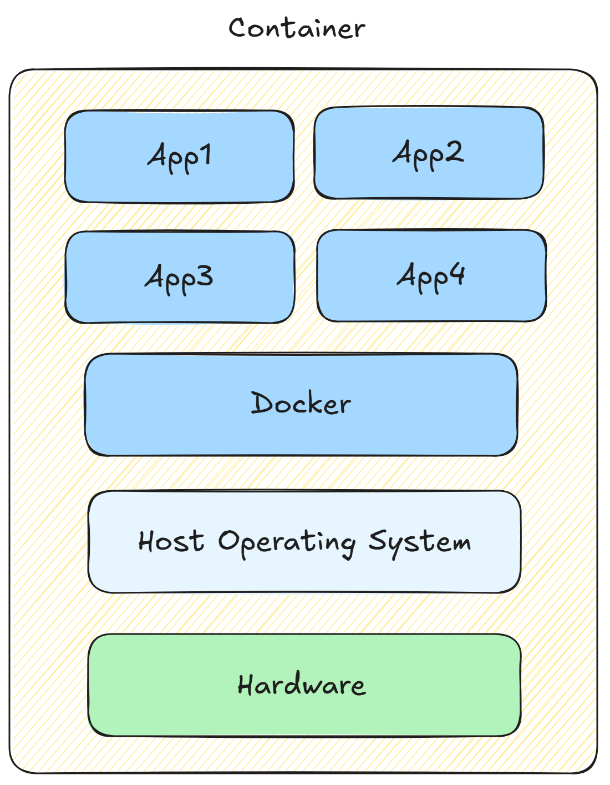
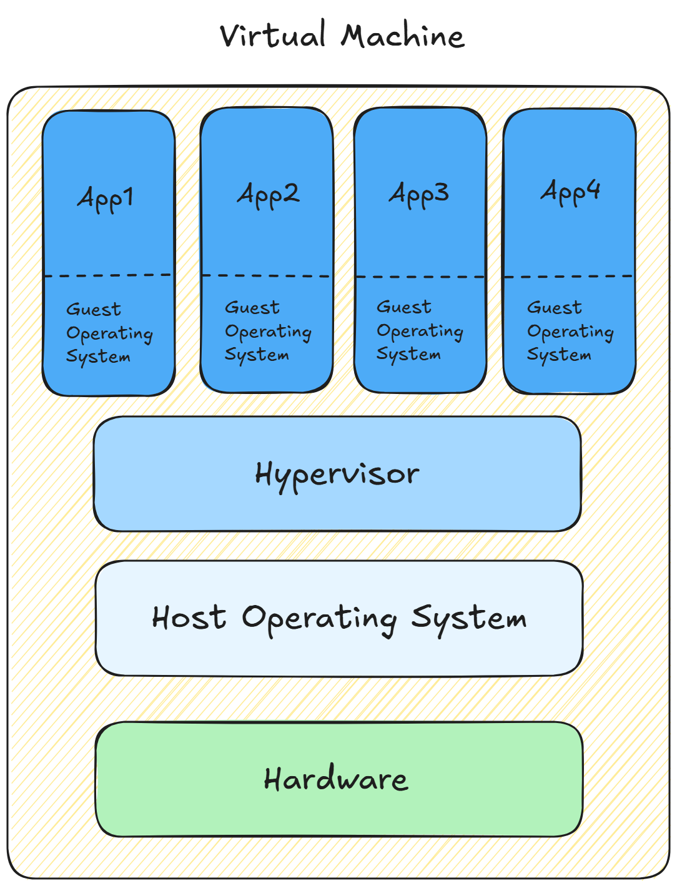

+++
date = '2025-09-07T20:24:08+08:00'
draft = false
title = '容器基本概念'
tags = ["容器", "docker"]
series = ["容器和K8S"]
series_order = 1
+++

## 基本概念
容器是一种***虚拟化***技术，可以用来运行各种应用程序。容器内包含所有必要的可执行文件、二进制代码、库和配置文件。

关于容器也有各种不同的定义：
- Google:

    容器是包含在任何环境中运行所需的所有元素的软件包。

- Docker：
    
    容器是一种标准的软件单元，它将代码及其所有依赖项打包在一起，使应用程序能够在不同的计算环境中快速且可靠地运行。Docker 容器镜像是一个轻量级、独立的可执行软件包，其中包含运行应用程序所需的一切：代码、运行时环境、系统工具、系统库和设置。

容器的本质是一个被***隔离***的、拥有自己***独立文件系统***和***进程空间***的进程。容器不是一个完整的操作系统，而是运行在宿主机上，依赖宿主机的内核来创建一个被隔离的、用于运行单个或一组应用的特殊环境。

---

## 容器 VS 虚拟机
### 容器
  
容器是应用层面的抽象，多个容器可以运行在同一台机器上且共享一个操作系统内核，每个容器都在自己的单独的进程空间中运行。

### 虚拟机

虚拟机是对物理硬件的抽象，做到将一台机器划分为多台机器。虚拟机管理程序（Hypervisor）允许单台机器上运行多个虚拟机。

其中虚拟机管理程序（Hypervisor）又分为两类：Type-1 Hypervisor和Type-2 Hypervisor。上图中描述的是Type-2 Hypervisor，是作为宿主机上的一个应用程序执行的。Type-1 Hypervisor是直接可以裸机运行的，相当于没有操作系统这一层。

### 对比总结
容器和虚拟机具有相似的资源隔离和分配优势，但是容器虚拟化的是操作系统，虚拟机虚拟化的是硬件，所以它们的功能有所不同。容器更具可移植性和效率。

以下是虚拟机和容器的对比总结：

| 特性 | 虚拟机 (VM) | 容器 (Container) |
| :--- | :--- | :--- |
| **本质** | 隔离的硬件环境，运行一个完整的操作系统（Guest OS） | 隔离的进程，利用宿主机的内核 |
| **隔离级别** | 硬件级别隔离，每个虚拟机都有自己的内核和文件系统，隔离性强 | 操作系统级别隔离，多个容器共享宿主机内核，隔离性较弱 |
| **启动速度** | 慢（需要启动一个完整的操作系统） | 快（秒级或毫秒级） |
| **资源占用** | 高（每个 VM 都要分配独立的 CPU、内存、磁盘等） | 低（共享宿主机内核，只占用运行应用所需的资源） |
| **便携性** | 差（需要完整的镜像文件，通常 GB 级） | 好（镜像文件小，方便分发和部署） |
| **部署密度** | 低（一台物理机上能运行的 VM 数量有限） | 高（一台物理机上能运行的容器数量更多） |
| **典型应用** | 运行不同操作系统，在同一台机器上测试不同环境 | 微服务架构、快速迭代开发、持续集成/持续部署（CI/CD） |
| **核心技术** | **Hypervisor**（如 KVM, VMware ESXi） | **Namespaces** 和 **Cgroups**（Linux 内核技术） |
| **典型实现** | VMware、VirtualBox、KVM | Docker、Podman、LXC |

---

## Docker容器
Docker是容器技术一种流行的实现。容器的概念出现与Docker之前，Docker将复杂的容器技术进行封装简化，提供了简单易用的工具链和生态。

容器镜像在运行时会变成容器，在 Docker 容器的情况下，镜像在***Docker Engine***上运行时就会成为容器。容器化软件适用于基于 Linux 和 Windows 的应用程序，无论基础设施如何，其运行方式都保持一致。容器将软件与其环境隔离，确保即使在开发环境和测试环境之间存在差异，软件也能统一运行。

优点：
1. 标准：Docker 为容器创建了行业标准，因此它们可以在任何地方移植。
2. 轻量级：容器共享机器的操作系统内核，因此每个应用程序不需要一个操作系统，从而提高了服务器效率并降低了服务器和许可成本。
3. 安全：应用程序在容器中更安全，Docker 提供了业界最强大的默认隔离功能。

## 参考
1. <https://www.docker.com/resources/what-container/>
2. <https://www.netapp.com/zh-hans/devops/what-are-containers/>
3. <https://cloud.google.com/learn/what-are-containers?hl=zh-CN>