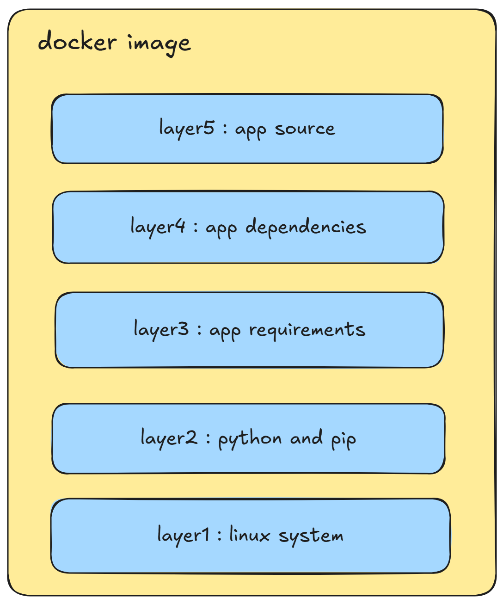

+++
date = '2025-09-02T23:58:21+08:00'
draft = false
title = 'Docker镜像解析'
tags = ["Docker", "镜像"]
+++

## 基础概念
Docker 镜像的本质是一个轻量级、可执行的、独立的文件包，它包含了运行一个特定应用所需的一切，包括：
- 应用程序代码
- 运行时环境（如 Java、Python、Node.js）
- 库文件
- 环境变量
- 配置文件

你可以把它想象成一个“***只读的模板***”或“***快照***”。这个模板可以被用来创建 Docker 容器。每个容器都是一个基于该镜像的独立运行实例，并且它们之间相互***隔离***。

---

## 特点
- ***分层存储***：

    这是 Docker 镜像最核心的概念。镜像不是一个单一的巨大文件，而是由多个只读的文件层（layers）叠加而成。每一层都代表对镜像的一次修改。

    这样分层的好处是可以高效利用存储空间，不同的镜像可以共享相同的镜像层，避免重复存储。
- ***只读不可变***：

    镜像本身是不可变的。镜像构建时，会一层层构建，前一层是后一层的基础。每一层构建完就不会再发生改变，后一层上的任何改变只发生在自己这一层。当我们从一个镜像启动一个容器时，Docker 会在镜像的顶部创建一个新的可写的层。所有对容器的修改都发生在这个可写层上，而不会影响到原始镜像。这确保了镜像的“模板”性质，无论你启动多少个容器，它们的基础都是一致的。

---

## 详细架构

以上是一个可能的docker镜像的结构。

最底层是一个linux系统的镜像。

第二层在系统镜像之上安装了python运行时环境和用来管理依赖的pip。

第三层存放应用程序特定的requirements.txt 文件。

第四层存放该应用程序的特定依赖项。

第五层存放应用程序的实际源代码。

## 构建镜像
先写一个简单的Go程序。
```go
package main

import (
	"context"
	"errors"
	"fmt"
	"net/http"
	"os"
	"os/signal"
)

func SayHello(w http.ResponseWriter, r *http.Request) {
	fmt.Println("success receive request")
	fmt.Fprintf(w, "Hello, World!")
}

func main() {
	mux := http.NewServeMux()
	mux.HandleFunc("/", SayHello)

	srv := &http.Server{
		Addr:    ":8080",
		Handler: mux,
	}

	quit := make(chan os.Signal, 1)
	signal.Notify(quit, os.Interrupt)

	go func() {
		fmt.Println("Server is running on port 8080")
		if err := srv.ListenAndServe(); !errors.Is(err, http.ErrServerClosed) {
			fmt.Println(err)
		}
	}()

	<-quit
	fmt.Println("Server is stopping")
	srv.Shutdown(context.Background())
	fmt.Println("Server is stopped")

}

```
然后编写Dockerfile。
```Dockerfile
# 使用官方 Go 镜像作为构建环境
FROM golang:1.24-alpine AS builder

# 设置工作目录
WORKDIR /app

# 复制 go.mod 和 go.sum 文件
COPY go.mod go.sum ./

# 下载依赖
RUN go mod tidy

# 复制源代码
COPY . .

# 构建应用程序
RUN CGO_ENABLED=0 GOOS=linux go build -a -o main .

# 使用轻量级的 alpine 镜像作为运行环境
FROM alpine:latest

# 设置工作目录
WORKDIR /root/

# 从构建阶段复制可执行文件
COPY --from=builder /app/main .

# 暴露端口 8080
EXPOSE 8080

# 运行应用程序
CMD ["./main"]

```

执行docker构建命令并运行容器。
```shell
## 构建docker镜像
docker build -t go-hello-world .

## 运行docker容器
docker run -p 8080:8080 go-hello-world

```

---

## 参考
1. <https://docs.docker.com/get-started/docker-concepts/building-images/understanding-image-layers/>
2. <https://yeasy.gitbook.io/docker_practice/basic_concept/image>

