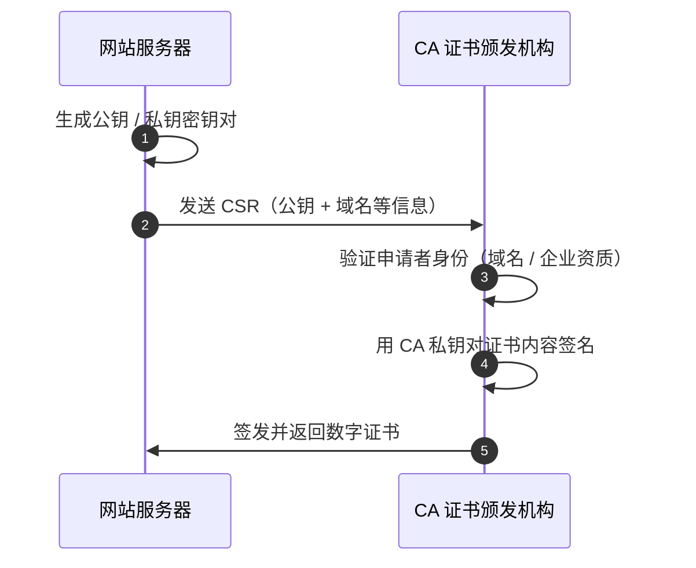
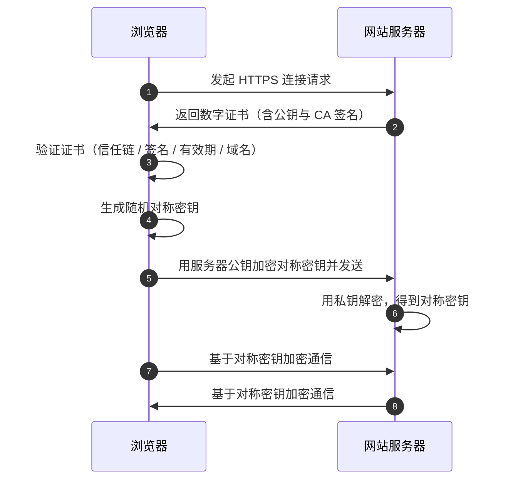

+++
date = '2026-07-30T00:18:11+08:00'
draft = false
title = 'https流程解析'
+++

## 基本概念
**https** 全称 Hypertext Transfer Protocol Secure，安全超文本传输协议，是 **http** 协议的扩展，通过 **TLS/SSL** 来进行加密。

## 核心目标
**https** 主要解决网络通信中的三大核心安全问题：
1. 身份验证：
	- 防止伪造和冒充：确保访问的是预期的目标网站，而不是黑客搭建的钓鱼网站。
2. 数据加密：
	- 保护传输安全：建立加密通道，确保在网络上传输的内容不会被中间人窃听。
3. 数据完整性：
	- 防止篡改内容：确保数据在传输的过程中没有被第三方篡改或者注入恶意代码。

## 工作流程
要理解工作流程，首先需要理解其中的关键角色：
- **CA**（Certificate Authority，证书颁发机构）：是受大家共同信任的第三方权威机构（如 Let's Encrypt）。
- 公钥与私钥：非对称加密中的概念。公钥所有人可见，这里用于加密和验签，私钥仅服务器持有，不可泄漏，这里用于解密和签名。

工作流程主要包含两个阶段：**事先证书的申请和颁发**和**客户端验证并建立连接**。
### 证书的申请和颁发
1. 生成密钥对与 CSR：网站服务器需要生成一对公钥和私钥，并将公钥和域名等信息打包成一个CSR（证书签名请求）发送给 CA。
2. CA 验证身份：CA 审核申请者的身份（验证是否真实拥有域名或审核企业资质）。
3. CA 签发证书：验证通过后，CA 将申请者的公钥、域名、有效期等信息整理好，并使用 CA 自己的私钥对这些信息进行数字签名，生成最终的数字证书发送给网站服务器。

### TLS握手与证书验证
当在浏览器输入某个网站地址例如[https://www.baidu.com](https://www.baidu.com)，背后的验证和握手流程如下：
1. 发起请求：浏览器想网站服务器发起 HTTPS 连接请求。
2. 服务器发送证书：网站服务器将自己的数字证书（包含服务器公钥和 CA 的签名）发送给浏览器。
3. 客户端验证证书：
	- 查找信任链：浏览器/操作系统预装了受信任的 ROOT CA（根证书机构） 公钥。
	- 验证签名：浏览器用 CA 的公钥解密数字证书的数字签名，并计算证书内容的哈希。若匹配，说明证书确实由 CA 签发且未被篡改。
	- 检查状态：检查证书是否在有效期中、域名是否匹配、是否被吊销。
4. 密钥协商：
	- 证书验证通过后，浏览器会生成一串随机的对称密钥。
	- 浏览器会用证书里包含的网站服务器的公钥加密这个对称密钥，发送给网站服务器。
5. 解密密钥：网站服务器用自己的私钥解密，拿到对称密钥。
6. 安全通信：后续的双方通信基于上述对称密钥进行高效加密传输。

## 为何同时包含对称和非对称加密
- 非对称加密安全性高，但计算开销大、速度较慢，适合验证身份和传递密钥的场景
- 对称加密计算速度极快，在此处适合大数据量的内容传输，但是存在密钥泄露的风险。